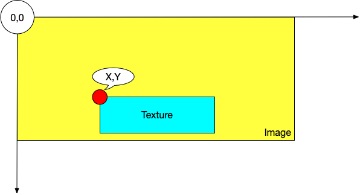

# Imagic


[](https://travis-ci.org/joway/imagic)
[](https://goreportcard.com/report/github.com/joway/imagic)
[](https://codecov.io/gh/joway/imagic)
[](https://circleci.com/gh/joway/imagic)

An easy and fast tool to process images. [https://github.com/joway/imagic](https://github.com/joway/imagic)

## Install

```shell
go get github.com/joway/imagic
```

## Usage

### Supported format

- png
- jpeg

### Global Flags

```shell
-o, --output string   Output directory
-p, --parallel int    Number of parallel tasks (default 4)
-s, --suffix string   Suffix of precessed image filename, format: [base_filename][suffix].[ext]
```

### Compress

#### Usage

```
-q, --quality int     Quality of image compression (default 70)
```

#### Example

```shell
$ imagic compress -q 70 -p 10 \
	-s .comp -o ./output \
	./testdata/**/*.png
```

### Resize

#### Usage

```shell
-l, --height int   Height of output image, default adaptive
-w, --width int    Width of output image, default adaptive
```

#### Example

```shell
$ imagic resize -w 320 -p 10 \
	-s .comp -o ./output \
	./testdata/**/*.jpg
```

### Watermark

#### Usage

```shell
-x, --X string         Pos X (default "+0")
-y, --Y string         Pos Y (default "+0")
-t, --texture string   Texture filename
```

#### Example

```shell
$ imagic watermark -x -600 -y -100 \
	-t ./testdata/images/texture.png \
	-p 10 -o ./output \
	./testdata/**/*.jpg
```

#### X,Y Position:



## Who's using Imagic?

[Jallery](https://pho.joway.io)

## Benchmark

[benchmark.md](docs/benchmark.md)

## Acknowledgement

- [libimagequant-go](https://github.com/joway/libimagequant-go)
- [imaging](https://github.com/disintegration/imaging)
- [mergi](https://github.com/noelyahan/mergi)


